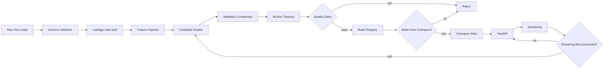

# MLForge — Production MLOps Platform

> An end-to-end, governed ML lifecycle for training, validating, versioning, serving, monitoring, and safely retraining classification models.

**Reference use case:** IBM Telco Customer Churn  
**Primary focus:** production ML engineering and MLOps governance — not maximizing churn-model complexity.

## The problem

A model with a good offline score is not automatically safe to operate. A production ML system also needs to answer:

- Can the data and feature pipeline be reproduced without leakage?
- Which experiment produced the current model?
- What prevents a weak retrained model from replacing production?
- Can inference fail visibly instead of silently?
- How do we detect changing inputs, predictions, or model quality?
- What evidence explains why a candidate was promoted or rejected?

MLForge was built around those questions. The churn classifier is deliberately a familiar use case so the repository can focus on the engineering lifecycle around the model.

## What I built

MLForge implements one controlled path from raw data to a production candidate:

```text
Raw data
  -> schema validation + leakage-safe split
  -> reproducible preprocessing
  -> candidate training + validation comparison
  -> MLflow experiment tracking
  -> quality gates
  -> model registry
  -> strict champion/challenger decision
  -> FastAPI inference
  -> production monitoring
  -> retraining recommendation
  -> governed retraining
  -> promote or reject with evidence
```

A monitoring alert **cannot promote a model**. Retraining creates another candidate, and that candidate must pass the same quality gates and strictly outperform the current champion before promotion.

## System architecture



For the detailed boundaries and responsibilities, see [docs/architecture.md](docs/architecture.md).

## Model evidence

The governed Day-03 run selected **Logistic Regression** on validation ROC-AUC. The point of the benchmark is reproducible model selection rather than choosing the most complicated estimator.

| Metric | Validation result |
| --- | ---: |
| ROC-AUC | **0.8453** |
| Average precision / PR-AUC | **0.6310** |
| F1 | **0.6182** |
| Precision | **0.6459** |
| Recall | **0.5929** |
| Accuracy | **0.8059** |

Configured eligibility gates include minimum ROC-AUC **0.80**, average precision **0.55**, and recall **0.50**. Passing those gates makes a candidate eligible for registry evaluation; it does not guarantee promotion.

## Engineering decisions

| Decision | Why |
| --- | --- |
| Locked test boundary | Prevent model selection from gradually overfitting the final evaluation set. |
| Validation ROC-AUC for selection | Use one explicit selection objective while still reporting complementary metrics. |
| Champion/challenger aliases | Separate a logical production role from an immutable registered model version. |
| Strict improvement for promotion | A retraining run should not replace the champion merely because it passed minimum thresholds. |
| Monitoring is advisory | Drift is evidence to investigate/retrain, not permission to mutate production state. |
| Fail readiness when the model is unavailable | Prefer visible failure over silently serving an unverified fallback. |
| Container excludes local MLflow state | Keep workstation-specific registry/artifact state out of the deployable image. |

More detail: [Engineering decisions](docs/engineering_decisions.md).

## Production-oriented engineering

- **Data reliability:** schema validation, explicit data contract, deterministic stratified split, leakage audit.
- **Training:** reusable preprocessing, multiple candidate estimators, consistent metrics and model comparison.
- **Experiment governance:** MLflow tracking, registered versions, quality gates, champion/challenger policy.
- **Serving:** FastAPI, Pydantic request validation, immutable version resolution, health/readiness contracts, request IDs and structured operational logs.
- **Packaging:** non-root Python 3.12 Docker image with container health check.
- **Monitoring:** feature drift, prediction drift and delayed-label performance checks.
- **Retraining:** monitoring-triggered decision path that reuses the governed training workflow and records promotion/rejection evidence.
- **CI/CD quality:** Ruff lint/format, pytest, source compilation and an independent Linux Docker build in GitHub Actions.

## Repository map

```text
configs/                 Training, serving, monitoring and governance configuration
src/mlforge/data/        Loading, schema validation and splitting
src/mlforge/features/    Feature preparation and preprocessing
src/mlforge/training/    Candidate training and evaluation
src/mlforge/tracking/    MLflow experiment tracking
src/mlforge/registry/    Registered-model operations
src/mlforge/governance/  Quality and promotion gates
src/mlforge/serving/     FastAPI inference service
src/mlforge/monitoring/  Drift and performance monitoring
src/mlforge/retraining/  Retraining decision and orchestration
tests/                   Unit and integration coverage
docs/                    Contracts, architecture, audits and runbooks
.github/workflows/       Python CI and Linux container-build gates
```

## Reproduce the quality checks

Requires **Python 3.12**.

```bash
python -m venv .venv
# Windows PowerShell: .\.venv\Scripts\Activate.ps1
# Linux/macOS: source .venv/bin/activate

python -m pip install --upgrade pip
python -m pip install -e ".[dev]"

ruff check src tests
ruff format --check src tests
pytest -q
python -m compileall -q src
docker build -t mlforge:local .
```

The raw dataset is intentionally not committed. Place the IBM Telco Customer Churn CSV at:

```text
data/raw/WA_Fn-UseC_-Telco-Customer-Churn.csv
```

Runtime behavior is controlled by the YAML files under `configs/`.

## Release evidence

The `v1.0.0` baseline was promoted through the repository workflow only after the release PR passed both independent GitHub Actions gates:

```text
Python quality: Ruff lint -> Ruff format -> pytest -> compileall
Container quality: Linux Docker build
```

See the [v1.0.0 release](../../releases/tag/v1.0.0) and [release checklist](docs/release_checklist.md).

## Production boundaries

This repository is a **production-oriented portfolio system**, not a claim that the demo is currently serving live customer traffic.

- MLflow currently uses a local SQLite-backed development configuration. A real deployment should use a remote tracking/registry backend and durable artifact storage.
- Prediction-event serialization exists as a monitoring contract, but persistence is not automatically wired into every API prediction.
- Drift checks are deterministic project-native diagnostics rather than an Evidently dashboard.
- The Docker image is independently build-tested in CI; this release does not claim a live cloud deployment.

These boundaries are documented deliberately so the project is reproducible and defensible rather than overstating production maturity.

## Documentation

- [Architecture](docs/architecture.md)
- [Engineering decisions](docs/engineering_decisions.md)
- [Production runbook](docs/production_runbook.md)
- [Release checklist](docs/release_checklist.md)
- [Data contract](docs/data_contract.md)
- [Data provenance](docs/data_provenance.md)
- [Leakage audit](docs/leakage_audit.md)
- [Retraining and CI/CD](docs/day06_retraining_cicd.md)
- [Production release audit](docs/day07_release_audit.md)

## 2-minute interview walkthrough

1. Start with the **problem**: offline model quality alone is not a production lifecycle.
2. Walk through the **architecture** from validation to registry, serving, monitoring and retraining.
3. Explain the **governance invariant**: monitoring can request retraining, but only quality gates plus strict champion improvement can promote.
4. Show the **evidence**: reproducible metrics, tests, GitHub Actions and the versioned release.
5. Finish with the **boundaries**: local MLflow and no claimed live cloud deployment.

## Author

**Ankur Kumar Jaiswal**  
M.Sc. Statistics | Machine Learning / Data Science
