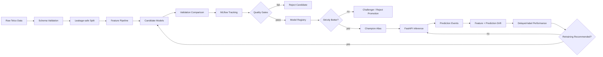

# MLForge Architecture

## System view

## Governance boundary

Monitoring is advisory: it can recommend retraining, but it cannot replace the champion. Every candidate must pass the validation quality gates and then beat the existing champion under the configured promotion rule.

## Data boundary

The raw dataset is ignored by Git. CI validates code without requiring private/local data. Training consumes the configured local data path, while the locked test split is excluded from model selection.

## Serving boundary

The API loads the registry alias and resolves it to an immutable model version before inference. Request validation is handled by Pydantic. Health and readiness are separate contracts, and raw request payloads are not written to operational logs.

## Deployment boundary

The Docker image contains application code and configuration, not local MLflow state. Real deployment requires a reachable MLflow tracking/registry service and durable artifact storage. This separation prevents a workstation-specific registry from being presented as portable production infrastructure.
